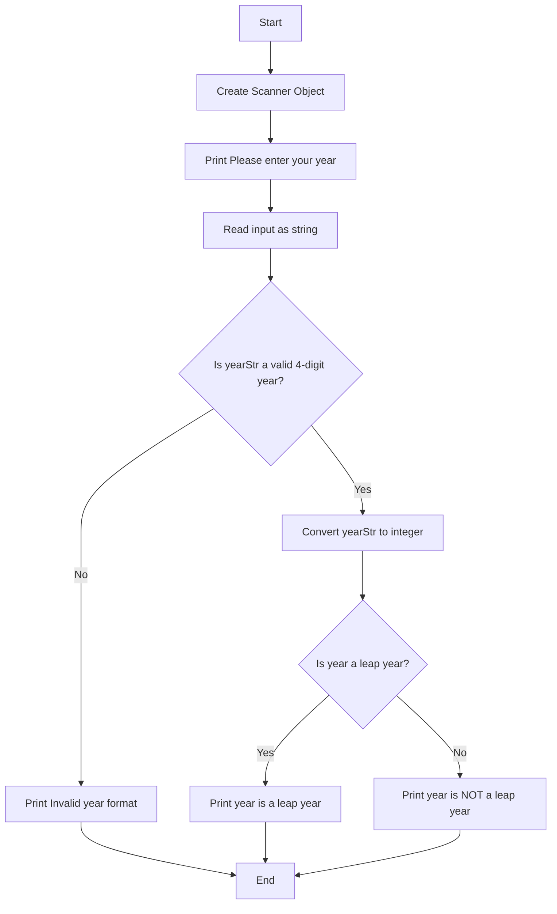
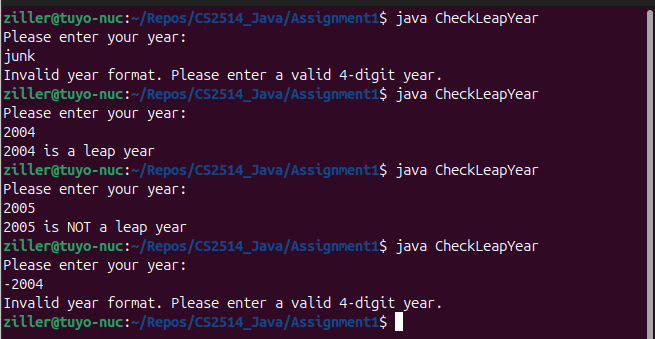
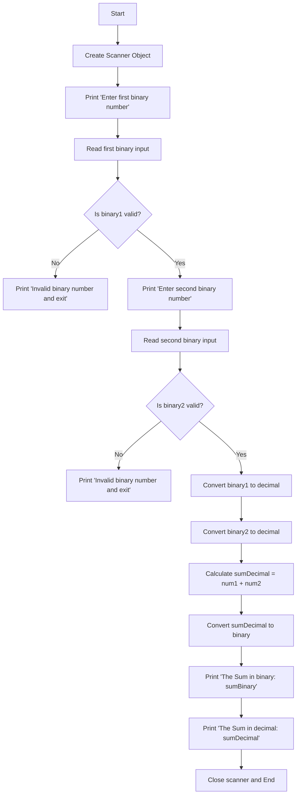
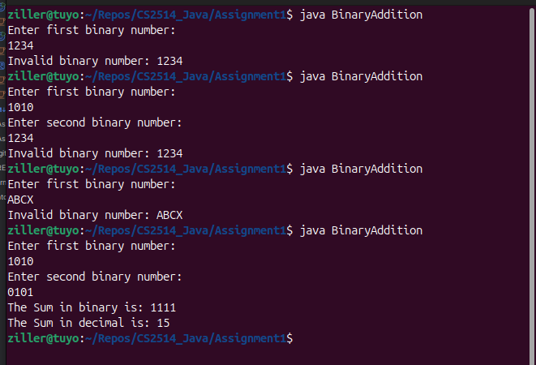
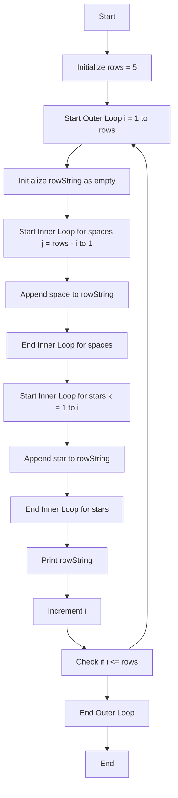
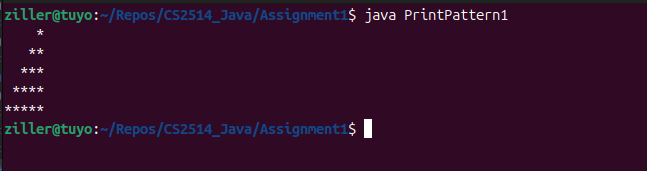

# Flow chart for Program 1 - Leap year Checker

```java
import java.util.Scanner;

public class CheckLeapYear {
    public static void main(String[] args){
        // Create a scanner object.
        Scanner myScanner = new Scanner(System.in);

        System.out.println("Please enter your year: ");
        // Read input as string to validate the format
        String yearStr = myScanner.nextLine();

        // Check if the input is a valid year
        if (isValidYear(yearStr)) {
            // and then convert the valid year string to an integer
            int year = Integer.parseInt(yearStr);

            // Now check if it's a leap year using the isLeapYear method
            if (isLeapYear(year)) {
                System.out.println(year + " is a leap year");
            } else {
                System.out.println(year + " is NOT a leap year");
            }
        } else {
            System.out.println("Invalid year format. Please enter a valid 4-digit year.");
        }
        // Close scanner.
        myScanner.close();
    }

    // Method to check if the year is a leap year
    // Returns a boolean true/false if its a leap year or not.
    // Assums the caller passes a correct into - 0000->9999

    public static boolean isLeapYear(int year) {
        // A year is a leap year if it is divisible by 4, but not divisible by 100 unless 
        //it is also divisible by 400..
        return (year % 4 == 0 && (year % 100 != 0 || year % 400 == 0));
    }

    // Need something to check if the input string is a valid year or not..
    // As the scanner might present any random string from the user we need
    // to ensure its in the year format before we can do anything iwth it.

    public static boolean isValidYear(String yearStr) {
        // Check if the string has exactly 4 characters
        if (yearStr != null && yearStr.length() == 4) {
            // Is everything a digit ???
            for (int i = 0; i < yearStr.length(); i++) {
                if (!Character.isDigit(yearStr.charAt(i))) {
                    return false; // Return false if any character is not a digit
                }
            }
            // At this point our yearStr is 4 digits between 0000 and 9999
            return true;
        }
        // If the string does not have exactly 4 characters, return false
        return false;
    }
}

```




# Flow chart for Program 2 - Binary Adder

```java
import java.util.Scanner;

public class BinaryAddition{
    public static void main(String[] args){
        // Open scanner object.
        Scanner myScanner = new Scanner(System.in);

        // Get first user defined input.
        System.out.println("Enter first binary number: ");
        String binary1 = myScanner.nextLine();

        // Check if the first input is a valid binary number
        if (!isValidBinary(binary1)) {
            System.out.println("Invalid binary number: " + binary1);
            myScanner.close();
            return;
        }

        // Get input 2.
        System.out.println("Enter second binary number: ");
        String binary2 = myScanner.nextLine();

        // Check if the second input is a valid binary number
        if (!isValidBinary(binary2)) {
            System.out.println("Invalid binary number: " + binary2);
            myScanner.close();
            return;
        }

        // Convert binary numbers to decimal
        int num1 = Integer.parseInt(binary1, 2);
        int num2 = Integer.parseInt(binary2, 2);

        // Calculate sum in decimal
        int sumDecimal = num1 + num2;

        // Convert the sum to binary
        String sumBinary = Integer.toBinaryString(sumDecimal);

        System.out.println("The Sum in binary is: " + sumBinary);
        System.out.println("The Sum in decimal is: " + sumDecimal);

        // Close scanner.
        myScanner.close();
    }


    // Ok, a string coming in, so need to check if its only 1's and O's
    public static boolean isValidBinary(String binary) {
        // Check each character in the string
        for (int i = 0; i < binary.length(); i++) {
            // If the character is neither '0' nor '1', return false
            if (binary.charAt(i) != '0' && binary.charAt(i) != '1') {
                return false;
            }
        }
        // If all characters are valid binary digits, return true
        return true;
    }
}

```




# Printing Patter for Program 3

```java
//PrintPattern1 - program prints out the following:
//    *
//   **
//  ***
// ****
//*****

public class PrintPattern1{
	public static void main(String[] args){
	
		// Number of rows to print
		int rows = 5;
		
		for (int i = 1; i <= rows; i++){
			// String buffer for each row.
			String rowString = "";

			// loop for spaces (going backwards)
			for (int j = rows + -i; j > 0; j--){
				rowString = rowString + ' '; 
			}

			// Loop for stars
			for (int k = 1; k <= i; k++){
				rowString = rowString + '*';
			}

			// Print buffer
			System.out.println(rowString);
		}

	}
}

```


