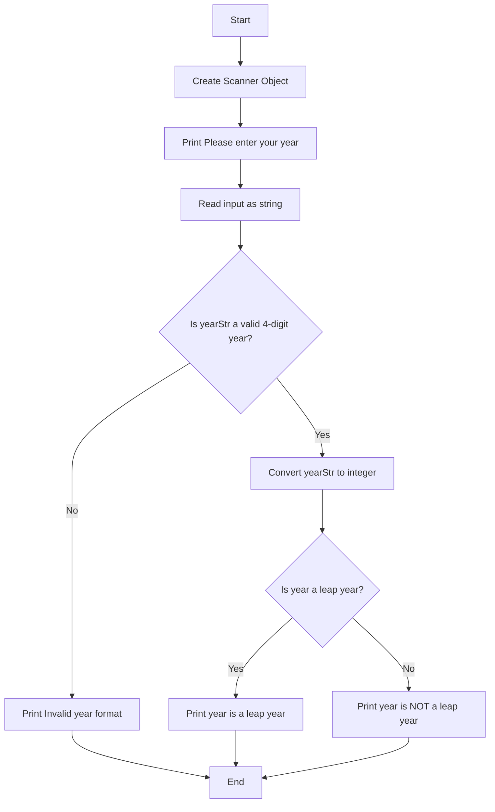
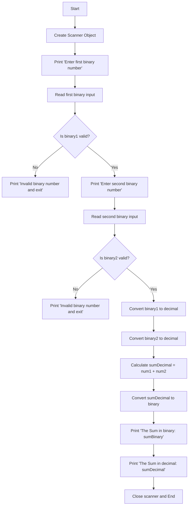

# Flow chart for Program 1 - Leap year Checker

```mermaid

 flowchart TD
    A[Start] --> B[Create Scanner Object]
    B --> C[Print Please enter your year]
    C --> D[Read input as string]
    D --> E{Is yearStr a valid 4-digit year?}
    E -->|Yes| F[Convert yearStr to integer]
    E -->|No| G[Print Invalid year format]
    F --> H{Is year a leap year?}
    H -->|Yes| I[Print year is a leap year]
    H -->|No| J[Print year is NOT a leap year]
    G --> K[End]
    I --> K
    J --> K
```

# Flow chart for Program 2 - Binary Adder

```mermaid
flowchart TD
    A[Start] --> B[Create Scanner Object]
    B --> C[Print 'Enter first binary number']
    C --> D[Read first binary input]
    D --> E{Is binary1 valid?}
    E -->|No| F[Print 'Invalid binary number and exit']
    E -->|Yes| G[Print 'Enter second binary number']
    G --> H[Read second binary input]
    H --> I{Is binary2 valid?}
    I -->|No| J[Print 'Invalid binary number and exit']
    I -->|Yes| K[Convert binary1 to decimal]
    K --> L[Convert binary2 to decimal]
    L --> M[Calculate sumDecimal = num1 + num2]
    M --> N[Convert sumDecimal to binary]
    N --> O[Print 'The Sum in binary: sumBinary']
    O --> P[Print 'The Sum in decimal: sumDecimal']
    P --> Q[Close scanner and End]

    class A,Q startend;
```

