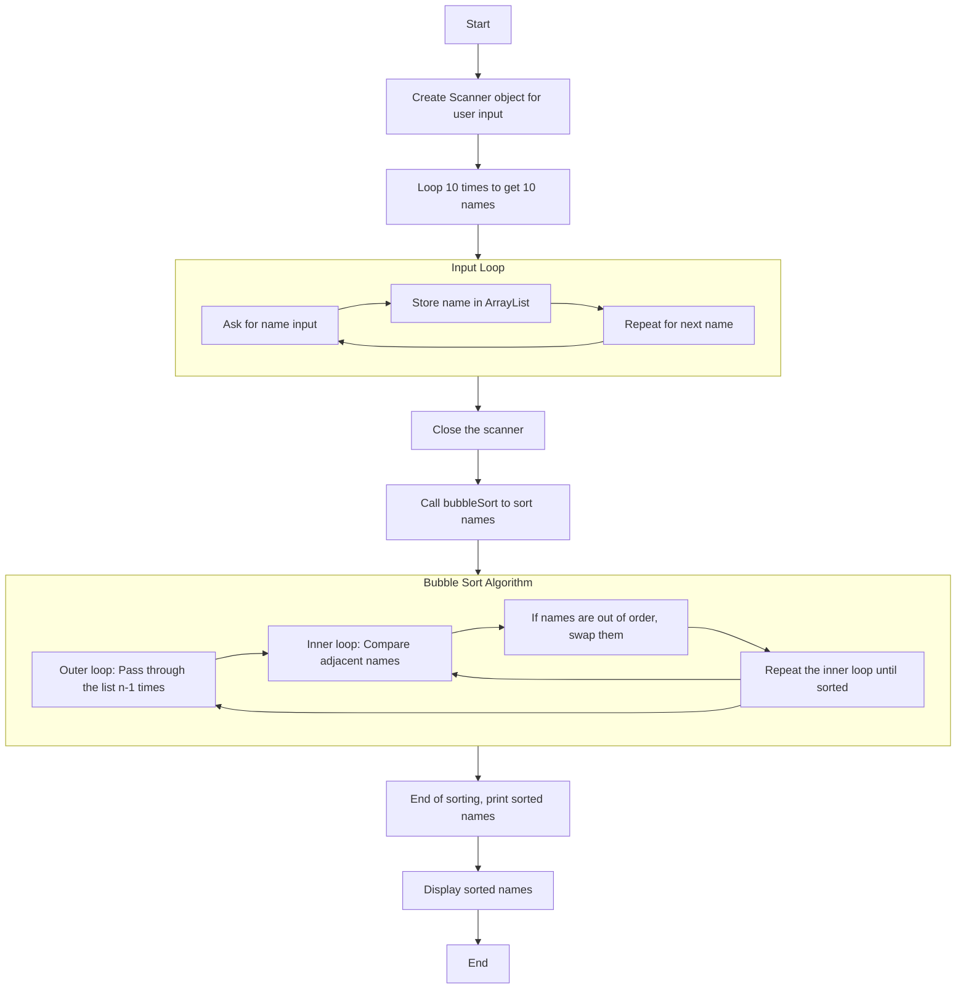
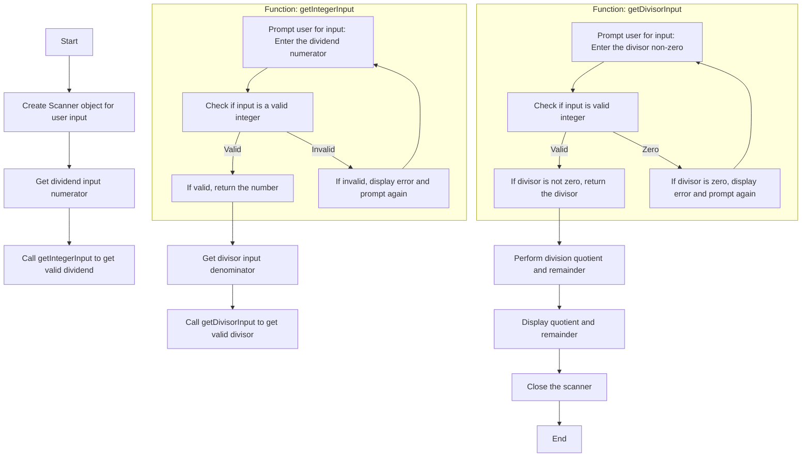
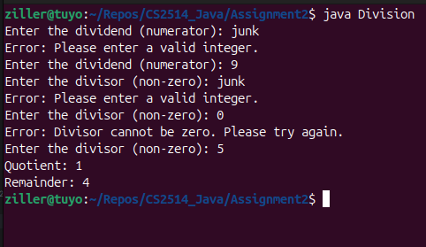
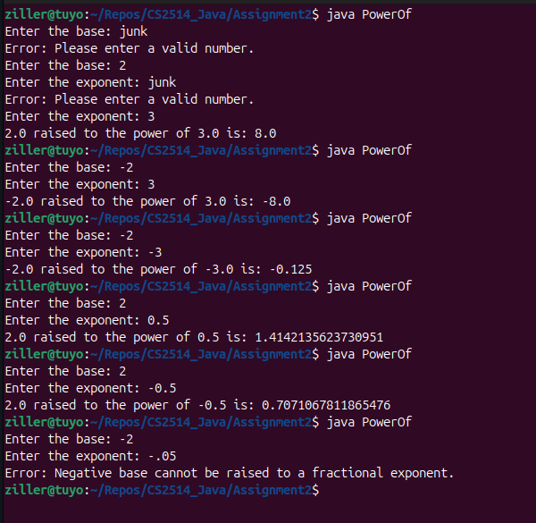

# Program 1



```java
import java.util.*;
public class OrderNames{
    public static void main(String[] args){
        // make list buffer
        ArrayList<String> names = new ArrayList<>();

        // Create Scanenr Object
        Scanner scanner = new Scanner(System.in);

        // Make a loop of 10, ask for name -> store in list buffer
        for (int i = 1; i <= 10; i++){
            System.out.print("Please enter a name: ");
            String name = scanner.nextLine();
            names.add(name);	// Appending to array.
        }

        scanner.close();

        // Sort list of names -> Alphabetically
        //Collections.sort(names);
        bubbleSort(names);

        System.out.println("Sorted names: ");
        // Iterate over names and print
        for (String name : names){
            System.out.println(name);
        }
    }

    // Instead of using Collections.sort I'm going to try and
    // create my own sort algo here as recommended by question.
    // So bubblesort seems a good idea from CS2516:Algorithms and Data Structures

    public static void bubbleSort(ArrayList<String> names) {
        int n = names.size();
        // Outer loop for each pass
        for (int i = 0; i < n - 1; i++) {
            // Inner loop for comparing adjacent elements
            for (int j = 0; j < n - i - 1; j++) {
                // Compare adjacent strings
                // This should handle Adrian vs Aidan scenarios..
                if (names.get(j).compareTo(names.get(j + 1)) > 0) {
                    // Swap if elements are in the wrong order
                    String temp = names.get(j);
                    names.set(j, names.get(j + 1));
                    names.set(j + 1, temp);
                }
            }
        }
    }
}

```

# Program 2 - Division



```java
import java.util.Scanner;

public class Division {

    public static void main(String[] args) {
        Scanner scanner = new Scanner(System.in);

        // When I ask for the user input I need to make sure its Real numbers
        // and also ensure the Divisor is not zero.
        // So we introduce two methors to handle this checking..

        // Get the dividend (numerator)
        int dividend = getIntegerInput(scanner, "Enter the dividend (numerator): ");

        // Get the divisor (denominator)
        int divisor = getDivisorInput(scanner);

        // Perform the division and output the result
        int quotient = dividend / divisor;
        int remainder = dividend % divisor;

        System.out.println("Quotient: " + quotient);
        System.out.println("Remainder: " + remainder);

        scanner.close();
    }

    // Method to get a valid integer input
    public static int getIntegerInput(Scanner scanner, String prompt) {
        int number = 0;
        boolean valid = false;

        // Going to loop until I get valid integer from user
        while (!valid) {
            System.out.print(prompt);
            if (scanner.hasNextInt()) {
                number = scanner.nextInt();
                valid = true;
            } else {
                System.out.println("Error: Please enter a valid integer.");
                scanner.next(); // clear the invalid input
            }
        }
        return number;
    }

    // Method to get a valid divisor.
    // This also has to handle the divide by zero issue where the numerator did not.
    public static int getDivisorInput(Scanner scanner) {
        int divisor = 0;
        boolean valid = false;

        // Going to loop until I get valid integer from user
        while (!valid) {
            divisor = getIntegerInput(scanner, "Enter the divisor (non-zero): ");

            if (divisor == 0) {
                System.out.println("Error: Divisor cannot be zero. Please try again.");
            } else {
                valid = true;
            }
        }
        return divisor;
    }
}


```


## Program 3 - PowerOf

```java
import java.util.Scanner;

// While this program is simple the challenge is ensuring
// The user inputs correct values.
// Int is obvious, but double is a valid input here as well.
// So we create a method to handle ensureing what comes in is
// valid.

public class PowerOf {
    public static void main(String[] args) {
        Scanner scanner = new Scanner(System.in);

        // Get valid base input
        double base = getDoubleInput(scanner, "Enter the base: ");

        // Get valid exponent input (now a double)
        double exponent = getDoubleInput(scanner, "Enter the exponent: ");

        // Here we handle an interesting input permutation.
        // What if the user enters a negative number, but then a negative fraction as
        // the exponent. We essentailly end up with trying to get the root of
        // a negative number - which mathematically not possible.
        // so we try and catch it here....
        if (base < 0 && exponent % 1 != 0) {
            System.out.println("Error: Negative base cannot be raised to a fractional exponent.");
        } else {
            double result = Math.pow(base, exponent);
            System.out.println(base + " raised to the power of " + exponent + " is: " + result);
        }

        // Close scanner
        scanner.close();
    }

    // Method to get a valid double input from the user
    public static double getDoubleInput(Scanner scanner, String prompt) {

        // Keep asking until user enters valid data...
        while (true) {
            System.out.print(prompt);
            if (scanner.hasNextDouble()) {
                return scanner.nextDouble();
            } else {
                System.out.println("Error: Please enter a valid number.");
                scanner.next();
            }
        }
    }
}

```

