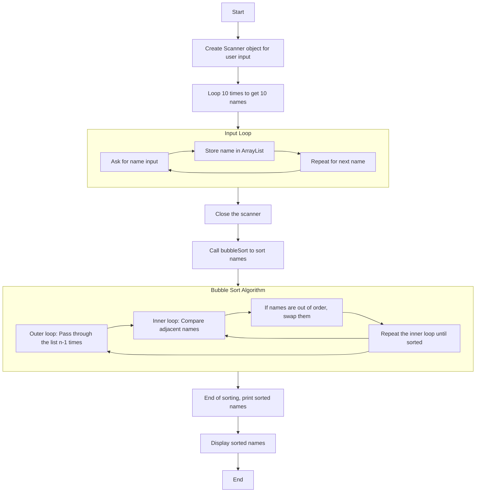

# Program 1



```java
import java.util.*;
public class OrderNames{
    public static void main(String[] args){
        // make list buffer
        ArrayList<String> names = new ArrayList<>();

        // Create Scanenr Object
        Scanner scanner = new Scanner(System.in);

        // Make a loop of 10, ask for name -> store in list buffer
        for (int i = 1; i <= 10; i++){
            System.out.print("Please enter a name: ");
            String name = scanner.nextLine();
            names.add(name);	// Appending to array.
        }

        scanner.close();

        // Sort list of names -> Alphabetically
        //Collections.sort(names);
        bubbleSort(names);

        System.out.println("Sorted names: ");
        // Iterate over names and print
        for (String name : names){
            System.out.println(name);
        }
    }

    // Instead of using Collections.sort I'm going to try and
    // create my own sort algo here as recommended by question.
    // So bubblesort seems a good idea from CS2516:Algorithms and Data Structures

    public static void bubbleSort(ArrayList<String> names) {
        int n = names.size();
        // Outer loop for each pass
        for (int i = 0; i < n - 1; i++) {
            // Inner loop for comparing adjacent elements
            for (int j = 0; j < n - i - 1; j++) {
                // Compare adjacent strings
                // This should handle Adrian vs Aidan scenarios..
                if (names.get(j).compareTo(names.get(j + 1)) > 0) {
                    // Swap if elements are in the wrong order
                    String temp = names.get(j);
                    names.set(j, names.get(j + 1));
                    names.set(j + 1, temp);
                }
            }
        }
    }
}

```