# Program 1
Write a program in JAVA to create a 3D array (containing integer values) and display it on the console. Then input a number from user and check whether it is present.

## Terminal Out
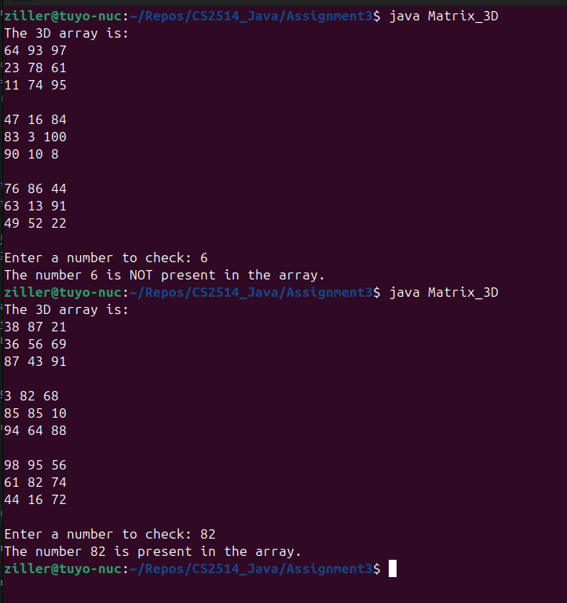
## Flowchart
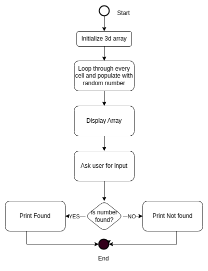
## Source Code
```java
import java.util.Random;
import java.util.Scanner;

// Class to create a random 3d array, then allow the user to check if a number exist in it.
public class Matrix_3D {
    public static void main(String[] args) {
        // x,y,z are the demsions of our array
        int x = 3, y = 3, z = 3;

        // Set up the matrix with the dimensions
        int[][][] array = new int[x][y][z];

        // To keep things interesting, going to use random numbers
        // to populate the array.
        Random random = new Random();

        // Initialize the array with random values between 1 and 100
        // 3 nested for loops, giving us an O(N^3)
        for (int i = 0; i < x; i++) {
            for (int j = 0; j < y; j++) {
                for (int k = 0; k < z; k++) {
                    array[i][j][k] = random.nextInt(100) + 1; // Random number between 1 and 100
                }
            }
        }

        // Similar style nested loops to print out the array we have so far.
        System.out.println("The 3D array is:");
        for (int i = 0; i < x; i++) {
            for (int j = 0; j < y; j++) {
                for (int k = 0; k < z; k++) {
                    System.out.print(array[i][j][k] + " ");
                }
                System.out.println();  // Newline for better readability
            }
            System.out.println();  // Add an extra line between 2D arrays
        }

        // The user now checks to see if their number is in the array...
        Scanner scanner = new Scanner(System.in);
        System.out.print("Enter a number to check: ");

        //
        int userNumber = scanner.nextInt();

        // Default to not found until we find it...
        boolean found = false;

        // Our familar tripple nested loop
        for (int i = 0; i < x; i++) {
            for (int j = 0; j < y; j++) {
                for (int k = 0; k < z; k++) {
                    if (array[i][j][k] == userNumber) {
                        found = true;   // we found the user's number, so we can
                        break;  // break out of the search loop.
                    }
                }
                if (found) break;  // cascade out
            }
            if (found) break;   // cascade out further.
                                // Note Java does seem to have an assembly style label/jump feature
                                // but not sure how OO that is , so avoiding.
        }

        // We're at the results section now.
        if (found) {
            System.out.println("The number " + userNumber + " is present in the array.");
        } else {
            System.out.println("The number " + userNumber + " is NOT present in the array.");
        }
        
        scanner.close();
    }
}


```
# Program 2
Write a program in Java to implement a linked list containing 5 numbers <11, 22, 6, 89, 99> and then perform the following:

Then insert a number <50> in the third position of the linked list and print the new linked list <11, 22, 50, 6, 89, 99>

Delete the 2nd element of the linked list and print the remaining linked list <11, 50, 6, 89, 99>

Delete the 1st element of the linked list and print the remaining linked list <50, 6, 89, 99>

Delete the last element of the linked list and print the remaining linked list <50,6,89>

You are not allowed to use java.util.LinkedList

## Terminal Out
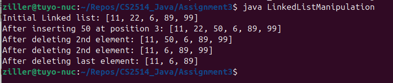
## Flowchart
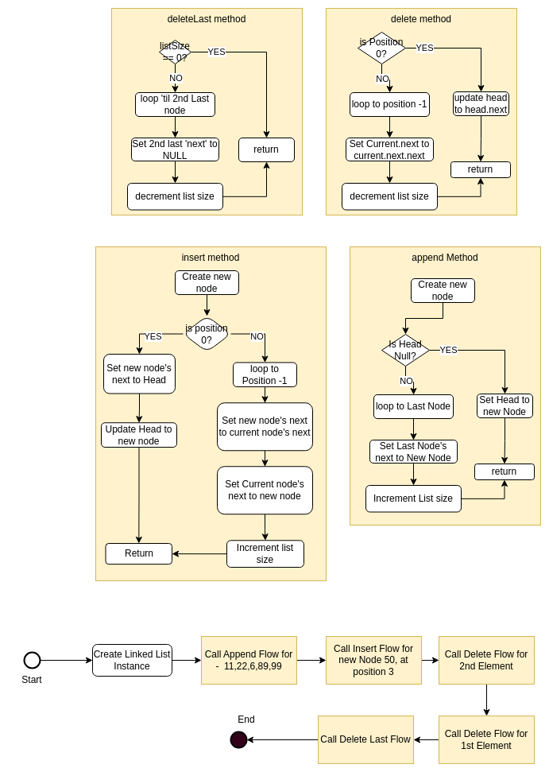
## Source Code
```java

// Custom Single Linked-List Class diagram.
public class CustomLinkedList{

	Node head;	// Reference to head of the list
	private int size; // Size of linked list


	// Node class for the Single linked list...
	static class Node{
		int data; // Node's data payload
		Node next; // pointer to next downstream on the list

		// Constructor
		public Node(int data){
			this.data = data;
			this.next = null; // default to null - don't know yet where we place it.
		}
	}

	// Constructor.
	public CustomLinkedList() {
		this.head = null;
		this.size = 0;
	}

	// Method to add node to end.
	public void append(int data){

		// wrap the data in its node instance.
		Node newNode = new Node(data);

		// If this is the first to be added to the list
		if (head == null) {
			head = newNode; // then it becomes the head.
		}
		else {
			// need to walk down the list to the last Node.
			Node current = head; 
			while (current.next != null) {
				current = current.next;
			}
			// when we get to end of list, we append by requiring
			// the current list's last node to point its next from
			// null to this new node. Note the new node is point to null
			current.next = newNode;
		}
		// increment the list size as we have added a new node.
		size++;
	}

	// Method to insert at a specific position
	// position is where we want to place it - the i'th location
	// data is the new data we want to store in our list
	public void insert(int position, int data){
		// basic error checking to ensure position is valid
		if (position < 0 || position > size){
			throw new IndexOutOfBoundsException("Invalid position");
		}

		// wrap the data in its new Node's instance.
		Node newNode = new Node(data);

		// Check do we want this new Node to be head?
		if (position == 0){
			// if so, we update our head pointer
			newNode.next = head;
			head = newNode;
		}else{
			// walk down the list until the node just before the
			// desired position
			Node current = head;
			for (int i = 0; i<position - 1; i++){
				current = current.next;
			}
			// rewire the linked list - setting the new node's next
			// to the position -1 's next
			// and then the position -1's next to this new node.
			newNode.next = current.next;
			current.next = newNode;
		}
		// new node means we increment the list size.
		size++;
	}

	// Deleting a node from the list at position
	public void delete(int position){
		// basic error checking to ensure position is valid
		if (position < 0 || position >= size){
			throw new IndexOutOfBoundsException("Invalid position");
		}

		// Special case if we are removing the head?
		// for example if this was a queue.
		if (position == 0){
			head = head.next;
		} else {
			// walk down the list to the node before the element to be removed.
			Node current = head;
			// wire the element out of the list
			for (int i = 0; i < position - 1; i++){
				current = current.next;
			}
			current.next = current.next.next;
		}
		// deleted element - so we need to reduce list size.
		size--;
	}
	public void deleteLast() {
			// If no elements we still succeeded
        	if (size == 0) return;
			// if we have 1, then we are getting rid of head.
        	if (size == 1) {
            		head = null;
        	} else {
					// walk down the list.
					// and point second from last to null.
					// garbage collection will take care of the last one.
            		Node current = head;
            		while (current.next.next != null) {
                		current = current.next;
            		}
            		current.next = null;
        	}
		// deleted element - so we need to reduce list size.
		size--;
    	}

	// Method to print the list
    	public void printList() {
		// Prity print of our list

        	Node current = head;
        	System.out.print("[");

			// Walk down the list, printing as we go.
        	while (current != null) {
            		System.out.print(current.data);
            		if (current.next != null) {
                		System.out.print(", ");
            		}
            		current = current.next;
        	}
        	System.out.println("]");
    	}

    	public static void main(String[] args) {

			// list instance.
        	CustomLinkedList list = new CustomLinkedList();

        	// Add initial elements
	        list.append(11);
        	list.append(22);
	        list.append(6);
        	list.append(89);
	        list.append(99);

        	System.out.print("Initial linked list: ");
        	list.printList();

        	// Insert 50 at position 2 (third position)
        	list.insert(2, 50);
	        System.out.print("After inserting 50 at position 3: ");
        	list.printList();

	        // Delete the 2nd element (position 1)
        	list.delete(1);
	        System.out.print("After deleting 2nd element: ");
        	list.printList();

	        // Delete the 1st element (position 0)
        	list.delete(0);
	        System.out.print("After deleting 1st element: ");
        	list.printList();

        	// Delete the last element
	        list.deleteLast();
        	System.out.print("After deleting last element: ");
	        list.printList();
    }
}


```
# Program 3
Write a program in Java to find duplicate characters in an user defined input sting

## Terminal Out
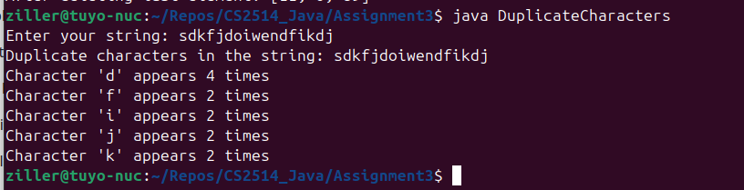
## Flowchart
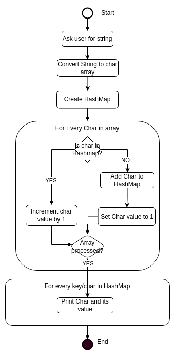
## Source Code
```java
import java.util.HashMap;
import java.util.Map;
import java.util.Scanner;

// Class to interrogate a user inputted string
// and find duplicate characters
public class DuplicateCharacters {
	public static void main(String[] args){
	
		Scanner scanner = new Scanner(System.in);

		System.out.print("Enter your string: ");
		String input = scanner.nextLine();

		// Find and print duplicate characters from user string.
		findDuplicateCharacters(input);

		scanner.close();
	}

	public static void findDuplicateCharacters(String str){

		// Useing a HashMap as a mechanism to collect character frequency info
		// [Char, charount]
		Map<Character, Integer> charCountMap = new HashMap<>();

		// Convert the string to character array
		char[] chars = str.toCharArray();

		// Count occurences of each character
		for (char c : chars) {
			// Was this character seen/stored before?
			if (charCountMap.containsKey(c)) {
				// if so, increment the count value by 1
				charCountMap.put(c, charCountMap.get(c) + 1);
			} else {
				// new observed char, so set count value to 1
				charCountMap.put(c,1);
			}
		}

		// Print Duplicate characters
		System.out.println("Duplicate characters in the string: " + str );
		boolean duplicatesFound = false;

		// Loop through the hashmap
		for (Map.Entry<Character, Integer> entry : charCountMap.entrySet()){
			// if a char is seen more than once, print out.
			if (entry.getValue() > 1){
				System.out.println("Character '" + entry.getKey() + "' appears " + entry.getValue() + " times");

			}
			duplicatesFound = true;
		}
	}
}

```
# Program 4
Write a program in Java to check palindrome string using data types queue and stack

## Terminal Out
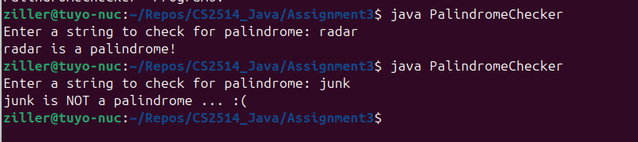
## Flowchart
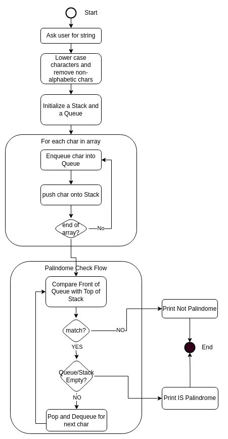
## Source Code
```java
import java.util.LinkedList;
import java.util.Scanner;
import java.util.Stack;
import java.util.Queue;

// Class to check if a string is a palindrome.
public class PalindromeChecker {

	public static void main(String[] args){
	
		Scanner scanner = new Scanner(System.in);

		System.out.print("Enter a string to check for palindrome: ");

		// process the input string.
		// first lower the case.
		// then a simple regex to recognize Palindomes should only work with letters and digits.
		// so if we see anything else strange, we mask out.
		String input = scanner.nextLine().toLowerCase().replaceAll("[^a-z0-9]", "");

		if (isPalindrome(input)){
			System.out.println(input + " is a palindrome!");
		} else {
			System.out.println(input + " is NOT a palindrome ... :(");
		}

		scanner.close();
	}

	public static boolean isPalindrome(String str) {

		// Using the classical Stack and Queue from Algo class
		// inserting the string into both results the string getting inverted
		// which means we can do a simple compare of each entry
		Stack<Character> stack = new Stack<>();
		Queue<Character> queue = new LinkedList<>();

		// Push characters onto the stack and queue
		for (int i = 0; i < str.length(); i++){
			char c = str.charAt(i);
			stack.push(c);
			queue.add(c);
		}


		// This is where we leverage the string pushed to a stack and enqueued in a queue
		// popping and removing each in parallel should tell us if we have a palindorme or not.
		while (!stack.isEmpty()){
			if (stack.pop() != queue.remove()){
				return false;
			}
		}
		return true;
	}
}

```
# Program 5
Write a program in Java to check two strings are anagram or not

## Terminal Out
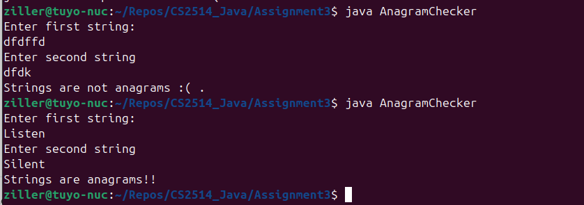
## Flowchart

## Source Code
```java
import java.util.*;

// Anangram Checker checks to see if 2 strings given
// by a user are anagrams.
public class AnagramChecker{
	public static void main(String[] args){
	
		// Create scanner object
		Scanner scanner = new Scanner(System.in);

		// Take the two strings from user.
		System.out.println("Enter first string: ");
		String str1 = scanner.nextLine();

		System.out.println("Enter second string");
		String str2 = scanner.nextLine();

		// Check if they are anagrams
		if (areAnagrams(str1, str2)){
			System.out.println("Strings are anagrams!!");
		}
		else {
			System.out.println("Strings are not anagrams :( .");
		}
		scanner.close();
	}

	// Takes two strings and returns true or false if they are an anagram of each other.
	public static boolean areAnagrams(String str1, String str2){

		// Normalize the string - drop all to lower case
		// and remove all tabs/spaces/newlines
		String s1 = str1.replaceAll("\\s", "").toLowerCase();
		String s2 = str2.replaceAll("\\s", "").toLowerCase();

		// Simple first check - if they are not the same length they cant be an anagram.
		if (s1.length() != s2.length()) {
			return false;
		}
		
		// Convert string the char arrays
		// so we can sort and compare
		char[] charArray1 = s1.toCharArray();
		char[] charArray2 = s2.toCharArray();

		// doing a simple sort of our char array will allow us to then
		// check if they are equal.
		Arrays.sort(charArray1);
		Arrays.sort(charArray2);

		// if the sorted arrays of characters are equal then
		//  return true, else return false.
		return Arrays.equals(charArray1, charArray2);
	}
}

```
# Program 6
You are asked to write a discount system for a beauty saloon, which provides services 
and sells beauty products. It offers 3 types of memberships: Premium, Gold and Silver. 
Premium, gold and silver members receive a discount of 20%, 15%, and 10%, respectively,
for all services provided. Customers without membership receive no discount. 
All members receives a flat 10% discount on products purchased (this might change in 
future). Your system shall consist of three classes: Customer, Discount and Visit, as
shown in the class diagram. It shall compute the total bill if a customer purchases 
$x of products and $y of services, for a visit. Also write a test program to exercise 
all the classes.

## Terminal Out
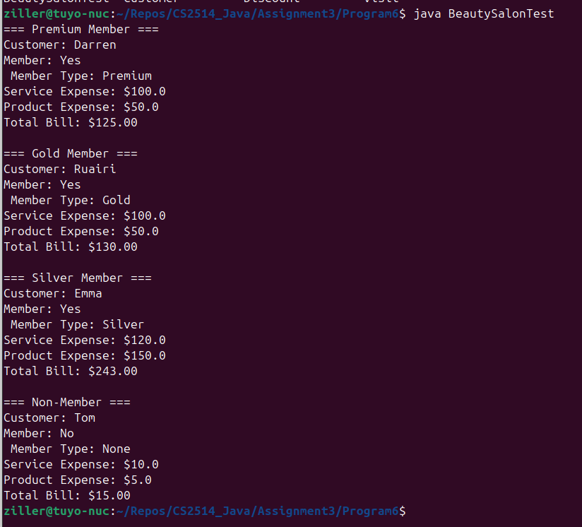
## Flowchart
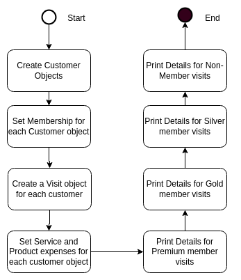
## Source Code

### Customer Class
```java

// Class to represent Customer.
// Standard name parameter, but with additional attributes for
// Membership information.
public class Customer {
	private String name;
	private String memberType;
	private boolean member;

	// Constructor for Customer
	public Customer(String name) {
		this.name = name;
		this.member = false;
		this.memberType = "None";
	}

	// Simple getter/setter methods.
	public String getName() {
		return name;
	}

	public boolean isMember() {
		return member;
	}

	public void setMember(boolean member){
		this.member = member;
	}

	public String getMemberType() {
		return this.memberType;
	}

	public void setMemberType(String memberType) {
		this.memberType = memberType;
		this.member = !memberType.equals("None");
	}

	// Using override java annotation to make code usage more intutitive.
	@Override
	public String toString() {
		return "Customer: " + name +
			"\nMember: " + (member ? "Yes" : "No") +
			"\n Member Type: " + memberType;
	}
}

```

### Discount Class

```java
public class Discount {

	// Using private static variables to hold the discount rates.
	// This means there is one shared copy, ergo no instance will hold
	// duplicate info.
	private static double serviceDiscountPremium = 0.2;
	private static double serviceDiscountGold = 0.15;
	private static double serviceDiscountSilver = 0.1;
	private static double productDiscountPremium = 0.1;
	private static double productDiscountGold = 0.1;
	private static double productDiscountSilver = 0.1;


	// Public static method to get service discount rate based on the type
	public static double getServiceDiscountRate(String memberType) {
		// In case users of our API miss-type member string, force string to UPPER
        String upperType = memberType.toUpperCase();

		// switch statement will control the correct rate returned for the
		// membership level.
		switch (upperType) {
			case "PREMIUM":
				// Note here and below - I don't have to do a 'this.'
				// as my rates are private static :-)
				return serviceDiscountPremium;
			case "GOLD":
				return serviceDiscountGold;
			case "SILVER":
				return serviceDiscountSilver;
			default:
				return 0.0; // Default return value of 0% discount
		}
	}

	// Public static method to get product discount rate based on membership type
	public static double getProductDiscountRate(String memberType) 	{
		// In case users of our API miss-type member string, force string to UPPER
        String upperType = memberType.toUpperCase();

		// switch statement will control the correct rate returned for the
		// membership level.
		switch (upperType) {
			case "PREMIUM":
				return productDiscountPremium;
			case "GOLD":
				return productDiscountGold;
			case "SILVER":
				return productDiscountSilver;
			default:
				return 0.0; // Default return value of 0% discount
		}
	}
}

```

### Visit Class
```java

// The visit Class represents a Customers visit to the beauty saloon.
// It 'has-a' Customer instance, and that customer will use an instance
// of this class to determine what type of discount they can avail of
// for a service or product - dependent upon their membership level.
public class Visit {
	// 'has-a' customer reference
	private Customer customer;

	// Variables to record the visit expenses.
	private double serviceExpense;
	private double productExpense;

	// Constructor setting up a visit instance for a customer visit.
	public Visit(Customer customer){
		this.customer = customer;
		this.serviceExpense = 0.0;
		this.productExpense = 0.0;
	}

	// Record Service transactions
	public void setServiceExpense(double serviceExpense) {
	
		this.serviceExpense = serviceExpense;
	}

	// Record Product expenses
	public void setProductExpense(double productExpense) {

		this.productExpense = productExpense;
	}

	// Get the visit's service expense tally
	public double getServiceExpense() {
		return serviceExpense;
	}

	// Get the visit's product expense tally
	public double getProductExpense() {

		return productExpense;
	}


	public double getTotalExpense() {
		double serviceDiscount;
		double productDiscount;

		// Calculate service discount based on whether the customer is a member
		if (customer.isMember()) {
			serviceDiscount = serviceExpense * Discount.getServiceDiscountRate(customer.getMemberType());
		} else {
			serviceDiscount = 0.0;  // No discount if not a member
		}

		// Calculate product discount based on whether the customer is a member
		if (customer.isMember()) {
			productDiscount = productExpense * Discount.getProductDiscountRate(customer.getMemberType());
		} else {
			productDiscount = 0.0;  // No discount if not a member
		}

		// Calculate the total expense after applying the discounts
		return (serviceExpense - serviceDiscount) + (productExpense - productDiscount);

	}

	// Using override java annotation to make code usage more intutitive.
	@Override
	public String toString() {
		return customer.toString() +
			"\nService Expense: $" + serviceExpense +
			"\nProduct Expense: $" + productExpense +
			"\nTotal Bill: $" + String.format("%.2f", getTotalExpense());
	}
}

```

### BeautySalonTest Class
```java
public class BeautySalonTest {
    public static void main(String[] args) {
        // Create customers
        Customer customer1 = new Customer("Darren");
        Customer customer2 = new Customer("Ruairi");
        Customer customer3 = new Customer("Emma");
        Customer customer4 = new Customer("Tom");
        
        // Set membership types for first 3 customers
        customer1.setMemberType("Premium");
        customer2.setMemberType("Gold");
        customer3.setMemberType("Silver");
        // Note, customer4 remains non-member
        
        // Customer 1 pays a visit
        Visit visit1 = new Visit(customer1);
        // And spends some money
        visit1.setServiceExpense(100.0);
        visit1.setProductExpense(50.0);

        // Customer 2 follows in.
        Visit visit2 = new Visit(customer2);
        // And buys the same stuff!
        visit2.setServiceExpense(100.0);
        visit2.setProductExpense(50.0);

        // Customer 3 makes an appearance.
        Visit visit3 = new Visit(customer3);
        // And has a bit more to spend
        visit3.setServiceExpense(120.0);
        visit3.setProductExpense(150.0);

        // Customer 4 comes in.
        Visit visit4 = new Visit(customer4);
        // And buys little because he decides he isn't a memeber
        visit4.setServiceExpense(10.0);
        visit4.setProductExpense(5.0);
        
        // Print results - using the nice override from the Visit class def.
        System.out.println("=== Premium Member ===");
        System.out.println(visit1);
        
        System.out.println("\n=== Gold Member ===");
        System.out.println(visit2);
        
        System.out.println("\n=== Silver Member ===");
        System.out.println(visit3);
        
        System.out.println("\n=== Non-Member ===");
        System.out.println(visit4);
    }
}

```