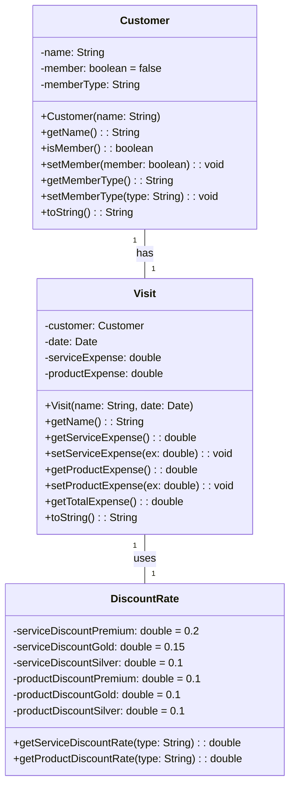

Kindly submit one single pdf document with (i) program code that has appropriate comments (ii) flowchart (iii) screenshot of output for each of the programs detailed below:

# Program 1

Write a program in JAVA to create a 3D array (containing integer values) and display it on the console. Then input a number from user and check whether it is present.

# Program 2

Write a program in Java to implement a linked list containing 5 numbers <11, 22, 6, 89, 99> and then perform the following:

Then insert a number <50> in the third position of the linked list and print the new linked list <11, 22, 50, 6, 89, 99>

Delete the 2nd element of the linked list and print the remaining linked list <11, 50, 6, 89, 99>

Delete the 1st element of the linked list and print the remaining linked list <50, 6, 89, 99>

Delete the last element of the linked list and print the remaining linked list <50,6,89>

You are not allowed to use java.util.LinkedList

# Program 3

Write a program in Java to find duplicate characters in an user defined input sting

# Program 4

Write a program in Java to check palindrome string using data types queue and stack

# Program 5

Write a program in Java to check two strings are anagram or not

# Program 6

You are asked to write a discount system for a beauty saloon, which provides services and sells beauty products. It offers 3 types of memberships: Premium, Gold and Silver. Premium, gold and silver members receive a discount of 20%, 15%, and 10%, respectively, for all services provided. Customers without membership receive no discount. All members receives a flat 10% discount on products purchased (this might change in future). Your system shall consist of three classes: Customer, Discount and Visit, as shown in the class diagram. It shall compute the total bill if a customer purchases $x of products and $y of services, for a visit. Also write a test program to exercise all the classes.

